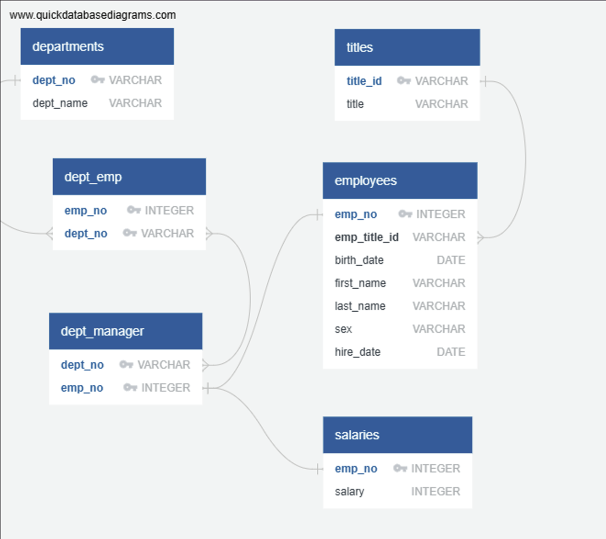
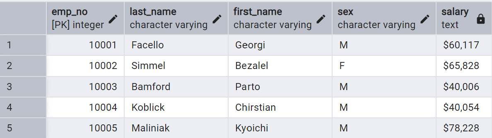
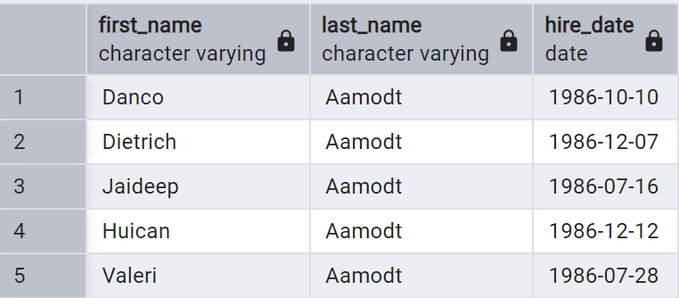
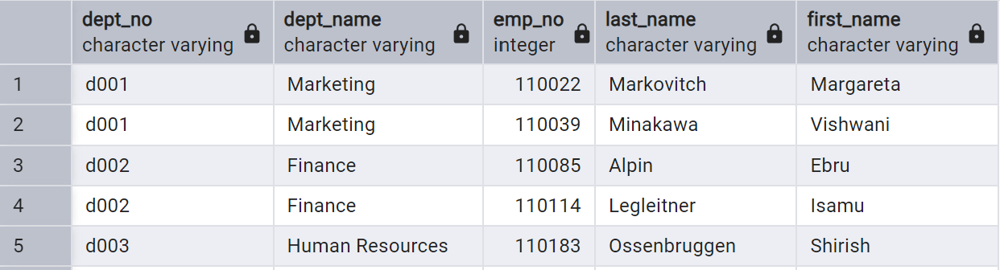
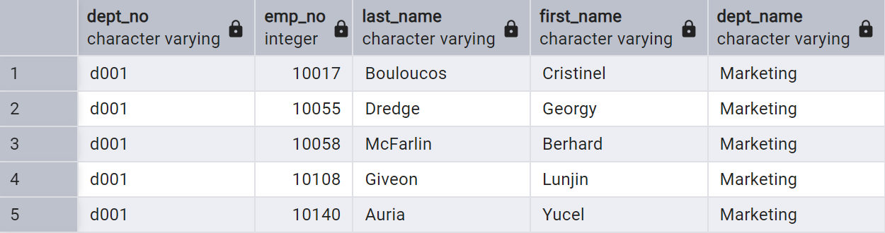
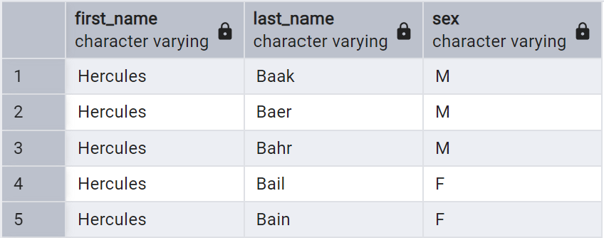
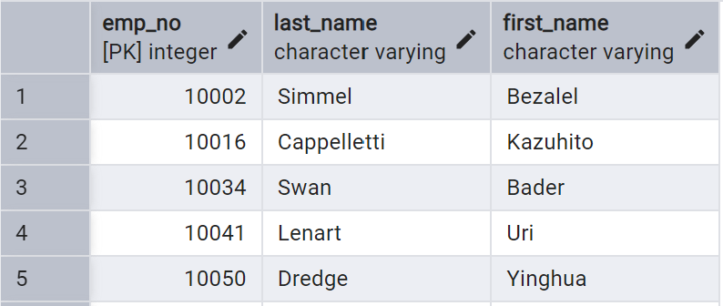
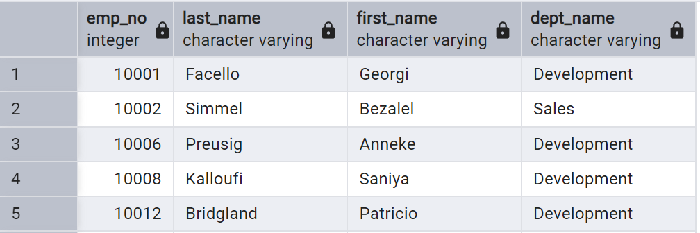
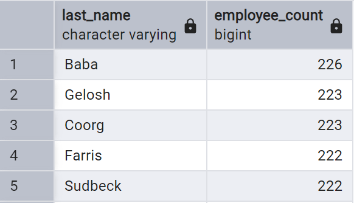

# sql-challenge

## Overview
Pewlett Hackard wants to better understand their employee population during the 1980s and 1990s. All that remains of the employee database from that period are six CSV files.

This challenge designed the tables to hold the data from the CSV files, imported the CSV files into a SQL database, and then answered questions about the data. See below for more details.

## Repo Contents
This repo contains the following files:
- EmployeeERD.png - entity relationship diagram for EmployeeDB
- EmployeeSchema.sql - file containing the schemata to create the SQL tables used for Data Analysis
- EmployeeQueries.sql - a file containing 8 queries which comprise the Data Analysis
- Images folder containing the images in this README file

## Data Model
The following six tables were created from the CSV files:
- "departments" - one row per department: department number, department name
- "dept_emp" - one row per employee: employee number, department number
- "dept_manager" - one row per department and manager: department number, employee number
- "employees" - one row per employee: employee number, title ID, birth_date, first name, last name, sex, hire date
- "salaries" - one row per employee: employee number, salary amount
- "titles" - one row per title: title ID, title

The below Entity Relationship Diagram depicts the tables in the EmployeeDB, including data and relationships:

## Data Engineering
The attached file, "EmployeeSchema.sql" contains all of the SQL statements to create the above tables and establish the appropriate relationships using primary/composite and foreign keys.

## Data Analysis
The attached file, "EmployeeQueries.sql" contains eight queries that provide results for the following requests. A snapshot of each result is included below.

1. List the employee number, last name, first name, sex, and salary of each employee

2. List the first name, last name, and hire date for the employees who were hired in 1986

3. List the manager of each department along with their department number, department name, employee number, last name, and first name

4. List the department number for each employee along with that employee’s employee number, last name, first name, and department name

5. List first name, last name, and sex of each employee whose first name is Hercules and whose last name begins with the letter B

6. List each employee in the Sales department, including their employee number, last name, and first name

7. List each employee in the Sales and Development departments, including their employee number, last name, first name, and department name

8. List the frequency counts, in descending order, of all the employee last names (that is, how many employees share each last name)

